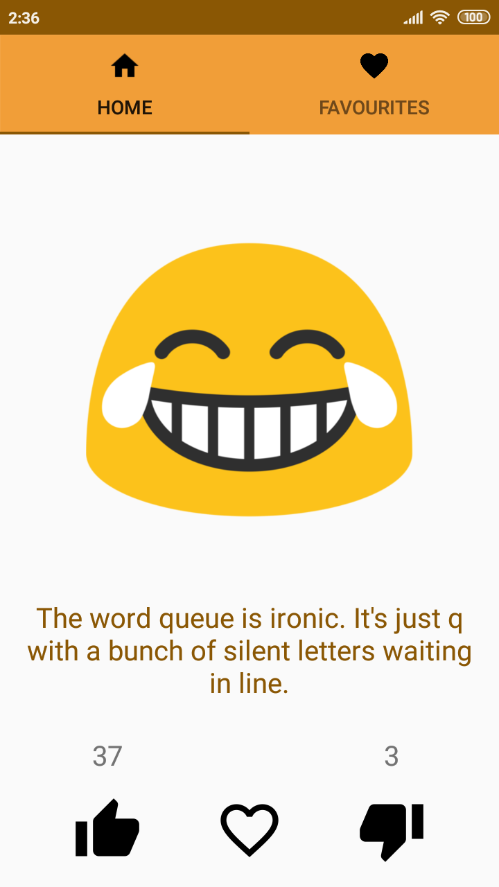
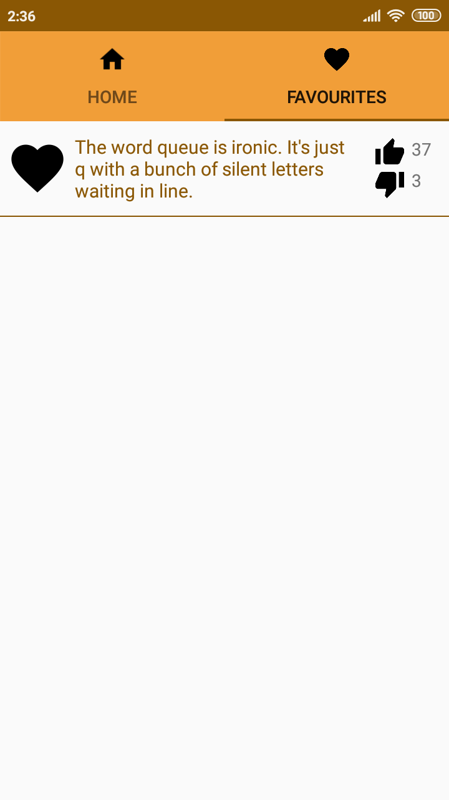
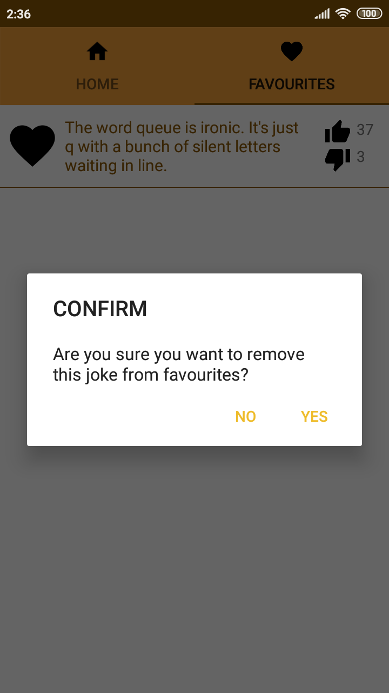

# Random jokes generator
An application that allows to generate a random joke, upvote/downvote it and add it to favourites.

##Usage example
A big emoticon on the homepage is a button used to generate new random joke.

When upvote or downvote button is clicked, the counter next to it increases.

When favourite button is clicked, the heart icon changes from empty to filled.

Favourited jokes are stored in favourites tab.

From here it is possible to remove the joke from favourites. After clicking the filled heart icon in order to do it, the app will ask for a confirmation.

-----------------------
**API: https://rapidapi.com/LemmoTresto/api/joke3?endpoint=apiendpoint_9991c4e7-955d-4689-9149-31d22b27b86e**
